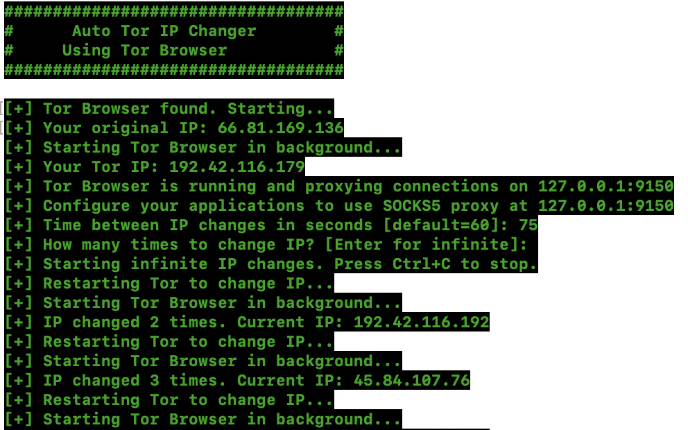

# Stock Market Sentiment Analysis and Performance Tracking of the S&P 500 using Scraping and APIs

This work is a combined approach using a Selenium-based web scraper and API data integration, with a Shiny app for analysis. 

## Overview

This project combines multiple data sources into a comprehensive data tool to track companies of the S&P 500:

1. **Web Scraper**: Uses Docker, Selenium, and R to automatically collect earnings call transcripts of all companies listed in the S&P 500
2. **API**: Uses R to fetch stock market data and financial metrics of all S&P 500 companies through API calls
3. **Shiny App**: Combines and visualizes all the data in an interactive dashboard

The Shiny App can be accessed [here](https://rstockmarketdashboard.shinyapps.io/Stock_market_dashboard/).

This repo contains both .R scripts and .Rmd markdown files. In the following, we will document the reproduction with the .Rmd files. However, you could 
also use the .R scripts. Indeed, the .R scripts offer our extensive messaging system which can help with debugging and monitoring progress.

## Web Scraper Instructions

#### Step 1: Set up Docker container

1. **Install Docker Desktop** for your operating system:
   - [Download Docker](https://www.docker.com/get-started)
   
2. **Start Docker and run the Selenium Firefox container:**
   ```bash
   docker run -d -p 4449:4444 --name selenium_firefox selenium/standalone-firefox:3.141.59
   ```
   **Note for Mac users with Apple Silicon (M1/M2/M3):** You may see a warning about platform mismatch (amd64 vs arm64). This is normal, and the container should still work properly.

3. **Verify the container is running:**
   ```bash
   docker ps
   ```
   You should see a container named `selenium_firefox` in the list.

#### Step 2: Set up R environment

1. **Download and install R from CRAN:**
   - **Windows users:** Select "Download R for Windows"
   - **Mac users:** Select "Download R for macOS"
     - For Apple Silicon Macs (M1/M2/M3), download the `arm64` version
   - **Linux users:** Select "Download R for Linux" and follow the instructions for your distribution
   
2. **Install RStudio Desktop**: [Download RStudio](https://posit.co/download/rstudio-desktop/)

3. **Open R or RStudio and install the required packages:**
   ```r
   install.packages(c("RSelenium", "rvest", "xml2", "lubridate", "tidyquant"))
   ```
   
#### Step 3: Run the Scraper

1. **Download the `scraper_script.R` file** from this repository.
2. **Open R or RStudio**.
3. **Set your working directory** to where you saved the script:
   ```r
   setwd("/path/to/folder/with/script")  # Replace with actual path
   ```
4. **Run the script:**
   ```r
   source("scraper_script.R")
   ```

#### How It Works
- Connects to the Selenium Firefox container
- Scrapes earnings call transcripts for S&P 500 companies
- Creates a file called `all_transcripts.csv` with the results
- Makes results available in R after every 5 tickers via the `current_transcripts_df` variable

#### Troubleshooting

- **If Docker container stops:** Restart it with:
  ```bash
  docker restart selenium_firefox
  ```
- **If the script can't connect to Selenium:** Check that the container is running:
  ```bash
  docker ps
  ```
- **For network issues:** Ensure that port `4449` is available on your system.
- **If you get a container conflict error:** This means a container with the name `selenium_firefox` already exists. You have two options:

  - **Remove the existing container before creating a new one:**

    ```bash
    docker rm -f selenium_firefox
    ```

  - **Run the new container with a different name by changing `selenium_firefox` to something unique:**

    ```bash
    docker run -d -p 4449:4444 --name selenium_firefox_new selenium/standalone-firefox:3.141.59
    ```

## API Instructions

These instructions outline three approaches to efficiently collect S&P 500 data from the Alpha Vantage API while circumventing (approaches one and three) or respecting rate limits (approach two).
The main approach is the most efficient one. But we also developed two alternative approaches. In particular, approach 2 is meant to be used in an automated way (i.e., through regular scheduling, e.g., on a VPS) once the user has created the full dataset. And approach three is meant to help the user create the full data set if the main approach does not work.

### Prerequisites

- **R/RStudio**: Version 4.0.0 or higher with required packages
- **Tor Browser**: Only for the main approach - [Download here](https://www.torproject.org/download/) (note: this webpage may not work on institutional wifi networks with high security controls)
- **Python 3.6+**: With the `requests` package installed
- **This repo**: You would need to clone this repo
- **.env file with API keys** API keys can be generated [here](https://www.alphavantage.co/support/#api-key)

### Basic Setup

This setup is the same for all three approaches. In each of those, you would need an .env file with API keys in your root directory that follows a specific format and the following R packages installed.

To this end, you would create a text file and paste your keys, following the structure:
ALPHA_VANTAGE_KEY_1=YOUR_KEY_1
ALPHA_VANTAGE_KEY_2=YOUR_KEY_2

You can add more keys if needed. For instance, if you used the main approach and wanted to download all the data in one go, 20 keys would be needed.
Then, save the .env file in the root directory (this cloned repo). It should be literally called ".env".

You could also do this in R:
``` R # Create .env
writeLines("ALPHA_VANTAGE_KEY_1=YOUR_KEY_1", ".env")
```

Then, you also need to install the required packages. In R, run:
``` R # Install packages
install.packages(c("httr", "jsonlite", "dotenv", "rvest"))
```

### 1. Main approach: Auto Tor IP Rotation

#### Overview
The Auto Tor IP Rotation approach uses the Tor network to rotate IP addresses, allowing us to make multiple API requests without hitting request limits. This method resolves the issue that Alpha Vantage has a hard limit of 25 requests per day and **per IP address**. For reference, we used [this](https://github.com/FDX100/Auto_Tor_IP_changer
) following tutorial to install Auto Tor.

If you installed Auto Tor and run it, your Terminal will look like this: 



#### Installation

##### For macOS Users
1. Navigate to the repository folder
2. Run the installation script in the terminal:
   ```bash
   chmod +x autotor/install_autotor_mac.sh
   ./autotor/install_autotor_mac.sh
   ```
3. The script will install all necessary components

##### For Linux Users
1. Navigate to the repository folder
2. Run the installation script in the terminal:
   ```bash
   chmod +x autotor/install_autotor_linux.sh
   ./autotor/install_autotor_linux.sh
   ```
3. Again, the script will install all necessary components

#### Usage
The easiest way to test and use this approach is to open the `API_main_approach.Rmd`or the corresponding script `API_main_approach.R`. In the Markdown, you would run chunk by chunk or render the document and in the script you would run the entire code at once. Make sure that Auto Tor is set up and works properly before.

If you prefer to work with the terminal, you could run the Rmd or the script via that. The commands are the following:

1. Start the Auto Tor IP Changer in the terminal:
   ```bash
   aut
   ```
2. When prompted:
   - Set the interval to 75 seconds
   - Press enter in order to choose "infinite" for the number of changes
     
3. Open another terminal window and run the Rmd (or the R script):
   For Mac/ Linux: 
   ```bash
   R -e "rmarkdown::render('API_main_approach.Rmd')"
   ```
   
   ```bash
   Rscript API_main_approach.R
   ```
   
   For Windows:
    ```bash
   Rscript -e "rmarkdown::render('API_main_approach.Rmd')"
   ```

   ```bash
   Rscript API_main_approach.R
   ```

#### Output files
1. sp500_fundamentals_batch_[timestamp].csv: individual batch results
2. batch_progress_temp.csv: temporary progress file updated after each successful request
3. sp500_fundamentals_combined.csv: combined results from all batches

**Important Note**: 
If you're using our pre-existing repository, sp500_fundamentals_combined.csv file will likely be complete. In this case:
The code will likely detect that all companies have already been collected and it might display a message: "No more symbols to process. All S&P 500 companies have been collected." Subsequently, you would not see the other two csv files being generated as the code would not enter the data collection phase in the first place.

Thus, to force collection of new data for testing purposes, you have three options:

-Delete the existing sp500_fundamentals_combined.csv file (in our view the simplest option)

-Rename or move the existing sp500_fundamentals_combined.csv file

-Modify the code to override the check (by editing the already_collected variable)

#### How It Works
1. IP Rotation: the Auto Tor IP changer restarts the Tor Browser at regular intervals, providing the user with a new IP address each time
2. Proxy Configuration: the R script connects through the Tor SOCKS proxy (127.0.0.1:9150)
3. API Requests: With constantly rotating IPs, we can make API requests without triggering rate limits; we are no longer constrained by our API address, but only by the (number of) API keys

#### Troubleshooting
- For the error "Failed to get IP through Tor", make sure that you click on "Always connect automatically" in the Tor Browser
- Tor Browser not starting: Make sure Tor Browser is properly installed
- Connection errors: Verify that Tor is running properly and the SOCKS proxy is accessible
- Slow response times: This is normal when using Tor; one solution is to play around with the request intervals

### 2. Backup 1: batched requests approach

#### Overview
This approach spreads the requests over time to avoid hitting the request limits for the IP address. While it can be run once, we developed it in way such that it can efficiently run on a VPS to fully automate the data collection. Indeed, the high-level idea is that the first approach is used **once** to build the initial dataset and this approach here is then used to regularly update it. Moreover, the script intentionally prioritizes companies by market cap and uses a smart refresh cycle to keep high-value data updated.


#### Usage
The easiest way to test and use this approach is to open the `API_backup_1.Rmd`or the corresponding script `API_backup_1.R`. In the Markdown, you would run chunk by chunk or render the document and in the script you would run the entire code at once.

If you prefer to work with the terminal, you could run the Rmd or the script via that. The commands are the following:

For Mac/ Linux
Run the Rmd in the terminal:
``` bash 
R -e "rmarkdown::render('API_backup_1.Rmd')"
```

Alternatively, run the script in the terminal:
``` bash 
Rscript API_backup_1.R
```

Run the script in the terminal with customized options:
``` bash
Rscript API_backup_1.R --auto --refresh=5 --combined=sp500_fundamentals_combined.csv
```

For Windows:
Run the Rmd in the terminal:
``` bash 
Rscript -e "rmarkdown::render('API_backup_1.Rmd')"
```

Alternatively, run the script in the terminal:
``` bash 
Rscript API_backup_1.R
```

Run the script in the terminal with customized options:
``` bash
Rscript API_backup_1.R --auto --refresh=5 --combined=sp500_fundamentals_combined.csv
```

#### How It Works

-Smart Prioritization: The script prioritizes S&P 500 companies by market capitalization

-Refresh Cycles: Top companies are refreshed more frequently in a configurable cycle

-Key Management: When one API key hits its rate limit, the script automatically switches to the next one

-Progress Tracking: Each day's collection is logged and saved separately, while also updating the main dataset 

-Error Handling: Failed requests are retried and logged, ensuring robust data collection

#### Output Files:

The output from the main function will be:

-sp500_fundamentals_combined.csv: combined file with all collected data

-sp500_fundamentals_batch_[DATE].csv: daily batch results

-alpha_vantage_progress_[DATE].rds: daily progress in RDS format

-processed_symbols_[DATE].txt: list of successfully processed symbols for the day

-alpha_vantage_progress_log.txt: detailed log of all operations

Note that both the R markdown and the script have a test function and the main function is currently commented out. The output from the test function will be found in test_fundamentals.csv


#### Configuration Options

--auto: Run in automatic mode

--refresh=N: Set the refresh cycle for top companies (default: 5 days)

--combined=FILE: Specify the combined output file path

### 3. Backup 2: manual Collection with VPN Rotation

#### Overview
This approach uses manual VPN rotation with multiple API keys to efficiently collect data. Essentially, it is based on a similar idea as the main approach, but requires more manual intervention. The script will prompt you to manually change your VPN location when needed.

#### Prerequisites

Any free VPN service would work (we used [PrivadoVPN](https://privadovpn.com/software/?device=macos)).
Multiple Alpha Vantage API keys in a .env file

#### Usage
Again, you could run the `API_backup_2.Rmd` or the `API_backup_2.R` manually or use the terminal, depending on your preferences. 
For this approach, we recommend the script. It would work as follows:

R script: 
First run: execute the entire script and then run the main function:
``` R # Load the script
source("API_backup_2.R")
```

``` R # Start collection with 100 companies, 25 requests per IP
main(sample_size = 100, requests_per_ip = 25)
```

When the VPN rotation message appears, change your VPN location
``` R # To check where you left off:
check_collection_progress()
```

``` R # To continue collection:
main(start_index = X)  # Replace **X** with the "Next start index" value from previous step
```

If you preferred the terminal, the commands would be as follows:

For Mac/ Linux:
``` bash
R -e "rmarkdown::render('API_backup_2.Rmd')" 
```

For Windows:
``` bash
Rscript -e "rmarkdown::render('API_backup_2.Rmd')"
```

#### How It Works

After a set number of requests per IP (requests_per_ip) - which is set to 25 by default - the code prompts you to change your VPN location. Progress is automatically saved after each successful request, allowing to resume at any time. The script created logs of the collection process and also generates both partially complete datasets and saves these.

#### Configuration Options

-sample_size: Number of companies to collect (default: 100)
-requests_per_ip: Requests before VPN rotation (default: 25)
-start_index: Index to resume collection from
-data_file: Path to the output CSV file


#### Troubleshooting

#### API Collection Issues
- **API rate limits**: Verify your approach configuration and adjust parameters if needed
- **Connection timeouts**: Check your internet connection and retry
- **Missing data**: Some symbols may not have complete data available; check logs for details

#### Auto Tor Issues
- **Cannot connect to Tor**: 
  - Ensure Tor Browser is running
  - Verify you clicked "Always connect automatically" when Tor Browser opened
  - Check if port 9150 is accessible


## Project Information

This is a school project created to demonstrate our skills in data acquisition and storage techniques using web scraping and API calls.

## License

This project is licensed under the MIT License - see the [LICENSE](LICENSE) file for details.

